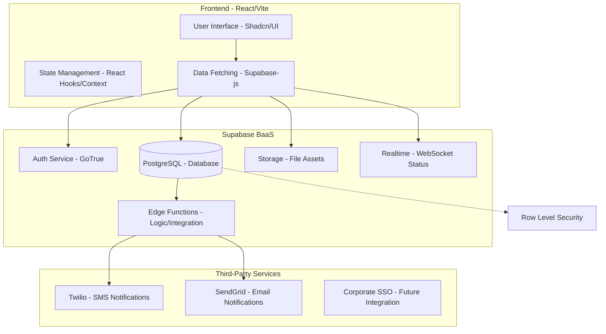

# Internal Service Request Platform (ISRP) - System Architecture

## Overview
The ISRP is built on a modern serverless architecture using React for the frontend and Supabase as the backend-as-a-service (BaaS). This ensures high performance, secure data handling, and rapid development.

## Architecture Diagram (Mermaid)

## Component Details

### 1. Frontend (React + Vite)
- **Framework**: React 18+ with Vite for fast bundling.
- **Styling**: Tailwind CSS & Shadcn/UI for consistent enterprise-grade design.
- **Security**: Supabase-js handles JWT token management and secure session persistence.

### 2. Backend (Supabase)
- **Database (PostgreSQL)**: Handles all persistence. Utilizes foreign keys, indexes, and complex queries.
- **Row Level Security (RLS)**: Enforces access control at the database level. Users only see requests they own or have permission to view (based on department/role).
- **Authentication**: Email/Password login initially, extensible to SAML/OIDC.
- **Storage**: S3-compatible storage for request attachments (photos, PDFs).
- **Edge Functions**: TypeScript-based serverless functions handle high-privilege tasks like triggering external SMS/Email APIs (Twilio/SendGrid) or processing complex workflow logic.

### 3. Workflow Engine
- The **Workflow Engine** is implemented via database triggers and Edge Functions. When a request status changes, a trigger can invoke an Edge Function to notify the next person in the hierarchy (e.g., Associate -> Senior -> Manager).

### 4. Notifications
- **In-App**: Handled via the `notifications` table and Supabase Realtime for instant UI updates.
- **External**: Triggered by Edge Functions connecting to SendGrid (Email) and Twilio (SMS).

### 5. Deployment
- **Frontend**: Hosted on Vercel or Netlify (standard CI/CD).
- **Backend**: Hosted on Supabase Cloud.
- **Database**: Managed PostgreSQL instance on Supabase.